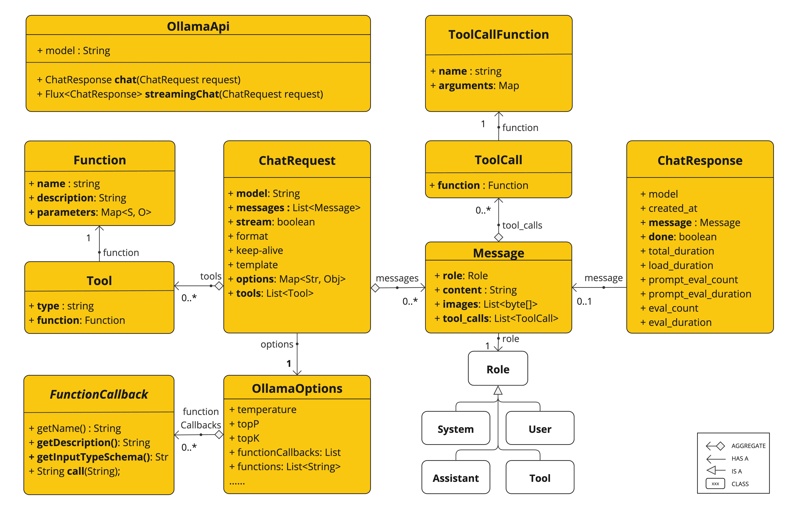

# Report Generation Application

This project is a Spring Boot application that serves as a Report Generation Tool, consisting of multiple modules to handle different functionalities.

## Status 

As of now, we have just started this project, so you won't find much code. We have added endpoints for generating AI responses in the `gen-ai-engine` module based on the provided prompt in the HTTP request **message** parameter.

## Table of Contents

- [Modules](#modules)
  - [Config Server](#config-server)
  - [Gen AI Engine](#gen-ai-engine)
  - [Vault](#vault)
  - [Cloud Integration API](#cloud-integration-api)
  - [Document API](#document-api)
  - [Insights API](#insights-api)
  - [Form Builder API](#form-builder-api)
  - [Notification API](#notification-api)
- [Getting Started](#getting-started)
- [Building and Running](#building-and-running)
- [Contributing](#contributing)
- [License](#license)

## Modules

### Config Server

The Config Server module is responsible for managing and providing configuration properties for the other modules in a centralized manner.

### Gen AI Engine

The Gen AI Engine module integrates AI capabilities into the application, providing various AI-powered features and functionalities. It is currently integrated with **Ollama**. This module supports the **Ollama** text generation with **OllamaChatModel**.


### Vault

The Vault module handles the secure storage of secrets, tokens, and other sensitive information.

### Cloud Integration API

The Cloud Integration API module facilitates communication and integration with various cloud services like AWS and Azure.

### Document API

The Document API module provides functionalities for managing and processing DocuSign documents for e-signatures on generated documents.

### Insights API

The Insights API module offers data analysis and insights generation features. In the future, it will generate dashboard configurations and data that can be used in front-end analytics dashboards, giving stakeholders better insights.

### Form Builder API

The Form Builder API module allows dynamic form creation and management.

### Notification API

The Notification API module handles sending notifications via various channels like email, SMS, etc.

## Getting Started

To get a local copy up and running, follow these simple steps.

### Prerequisites

- Java 22
- Git

### Installation

1. Clone the repository:
   ```sh
   git clone https://github.com/Samarpitgupta/report.git
